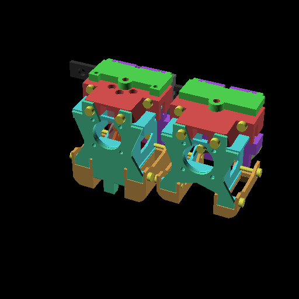

# XestBurner
 A light, modular toolhead

## BOM
 - Carriage
   - 6x M3x4x5 (Voron) heatsets
     - 2x for hotend/extruder
     - 2x for fan housing
     - 2x for probe mount
   - 2x M3x30 pins
 - Hotend
   - 2x M3x30 SHCS (BHCS works as well)
   - bolts to mount your hotend
 - Extruder
   - Dependent on variation, uses hotend bolts to carriage
 - Fan Housing
   - 2x 4010 blower fans
   - 1x 2510 axial fan
   - 2x M3x6 SHCS (BHCS works as well)
 - Probe
   - 2x M3x6 SHCS (BHCS works as well)
   - Dependent on variation
